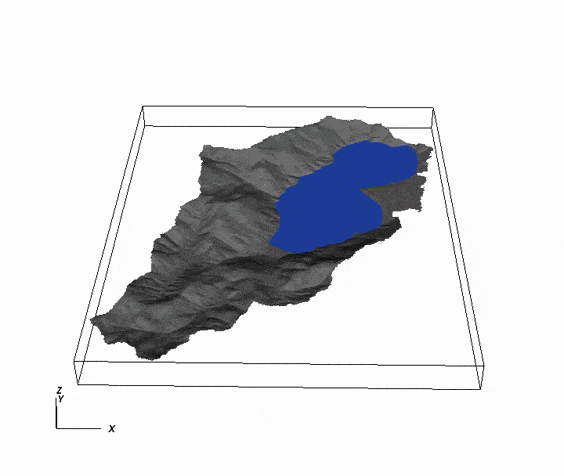

# SW2D-GPU 
Two-dimensional shallow water model accelerated by GPGPU

https://www.sciencedirect.com/science/article/abs/pii/S1364815221002474]

Developer of parallel code in GPGPU: Tomas Carlotto          | Code written in CUDA C/C++

This code or any part of it may be used as long as the authors are cited.
Under no circumstances will authors or copyright holders be liable for any claims,
damages or other liability arising from the use any part of related code.

    Prerequisites for using parallel code:
    Computer equipped with NVIDIA GPU (compatible with CUDA technology).
    Software required: CUDA™ Toolkit 8.0 or later 
                  
    Systems: Windows or Linux
         

Water flow simulation in the Peri Lake Watershed:

 

Dam break simulation:

